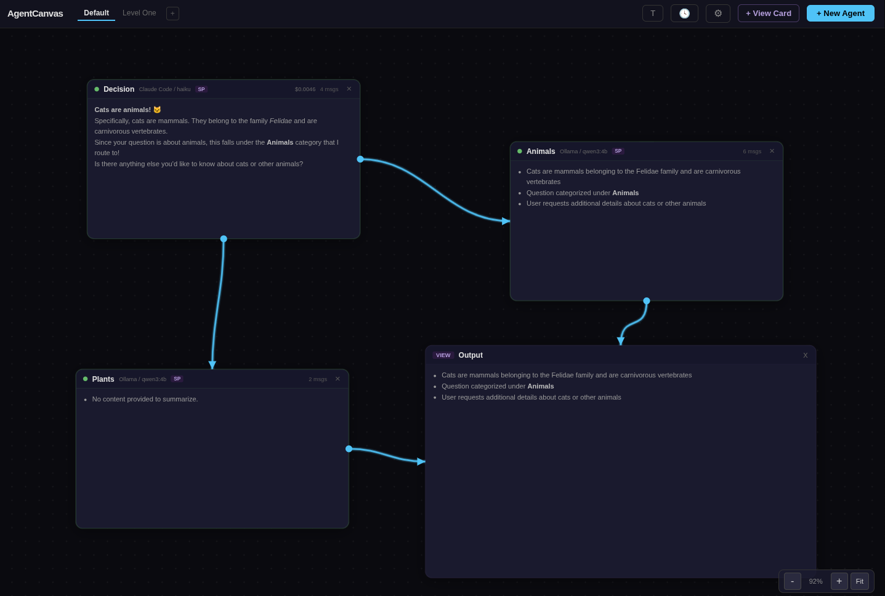
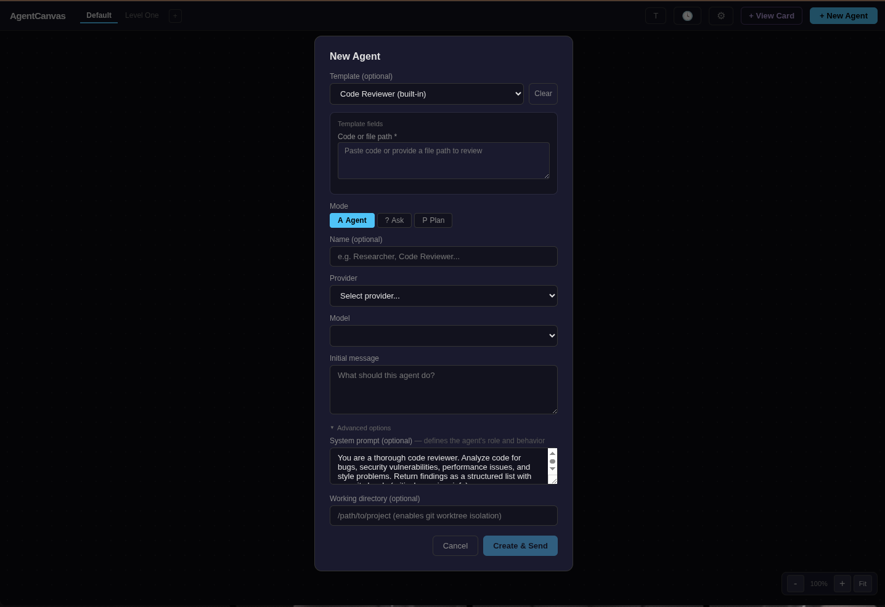
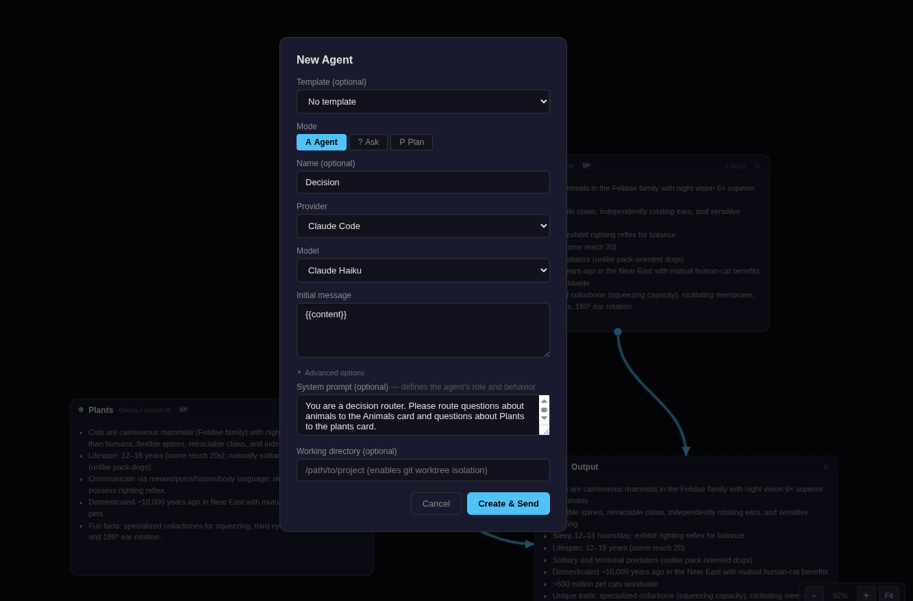

# AgentCanvas

A provider-agnostic AI agent orchestrator with a spatial canvas interface. Run multiple AI agents side-by-side, connect them with output routing, and manage everything from an infinite canvas.

Inspired by [OpenSwarm](https://github.com/openswarm-ai/openswarm), rebuilt from scratch to support CLI-based agents (Claude Code) and API-based agents (Ollama) as first-class citizens.



## Features

### Spatial Canvas
- Infinite canvas with drag-and-drop agent cards
- Zoom (Alt+scroll), pan (middle-click drag), resize cards in 8 directions
- Bezier connection lines with arrowheads and glow effects
- Multiple dashboards for organizing different workspaces
- Dot grid background that scales with zoom level

### Multi-Provider Agents
- **Claude Code** — spawns `claude -p` as a subprocess, parses stream-json output. Full tool use, session continuity via `--resume`, no API key needed (works with Claude Max)
- **Ollama** — HTTP client for any local model via OpenAI-compatible API, with agentic tool loop support



### Output Routing
- Connect agents with edges to chain outputs
- Conditional routing (`contains:`, `regex:`) for branching flows
- Transform templates with `{{output}}` and `{{output.field}}` placeholders
- JSON schema validation on routed output
- View cards for displaying final output

### MCP Tool Integration
- Configure MCP servers (stdio transport)
- Automatic tool discovery via JSON-RPC 2.0
- Per-tool permission policies: `always_allow`, `ask`, `deny`
- Human-in-the-loop approval flow with expandable tool arguments
- Built-in `invoke_agent` MCP server for sub-agent spawning

### Agent Modes & Templates



- Five built-in modes: Agent, Ask, Plan, View Builder, Skill Builder
- Reusable prompt templates with structured input fields
- Slash command invocation (`/template-name` in chat)
- Custom system prompts per agent

### Session Management
- Real-time streaming chat via WebSocket
- Cost tracking per session (live token count and USD display)
- Session history with search across names and message content
- Soft-delete with reopen support
- Sessions persist across restarts (JSON file storage)

### More
- Message branching — edit prior messages to fork conversations
- Git worktree isolation per agent
- Keyboard shortcuts (1-9 for agents, Shift+A/D for batch approval)
- Dark theme with status indicator animations

## Architecture

```
┌─────────────────────────────────────────────┐
│  Frontend (React 19 + TypeScript + Redux)   │
│  Vite dev server :5173                      │
└──────────────┬──────────────────────────────┘
               │ REST + WebSocket
┌──────────────▼──────────────────────────────┐
│  Backend (FastAPI + Python)                 │
│  Uvicorn :8000                              │
├─────────────────────────────────────────────┤
│  Providers        │  MCP Tool Executor      │
│  ├─ Claude Code   │  ├─ JSON-RPC client     │
│  └─ Ollama        │  ├─ Permission engine   │
│                   │  └─ invoke_agent server  │
├─────────────────────────────────────────────┤
│  Storage: ~/.local/share/agentcanvas/       │
│  ├─ sessions/     ├─ dashboards/            │
│  ├─ mcp_servers/  └─ permissions.json       │
└─────────────────────────────────────────────┘
```

## Getting Started

### Prerequisites
- Python 3.11+
- Node.js 20+
- (Optional) [Nix](https://nixos.org/) for reproducible dev environment

### Quick Start

```bash
# Clone
git clone https://github.com/barrulus/agentcanvas.git
cd agentcanvas

# With Nix (recommended)
nix develop
./run.sh

# Without Nix
# Backend
cd backend
pip install -r requirements.txt
uvicorn main:app --reload --port 8000

# Frontend
cd frontend
npm install
npm run dev
```

Open http://localhost:5173 in your browser.

### Provider Setup

**Claude Code** — requires `claude` CLI installed and authenticated. Works with Claude Max subscriptions (no API key needed).

**Ollama** — requires [Ollama](https://ollama.com/) running locally on the default port (11434). Pull any model with `ollama pull <model>`.

## API

Full REST API and WebSocket event documentation is available in the [design document](agentcanvas.md#api-surface).

## License

[MIT](LICENSE)
