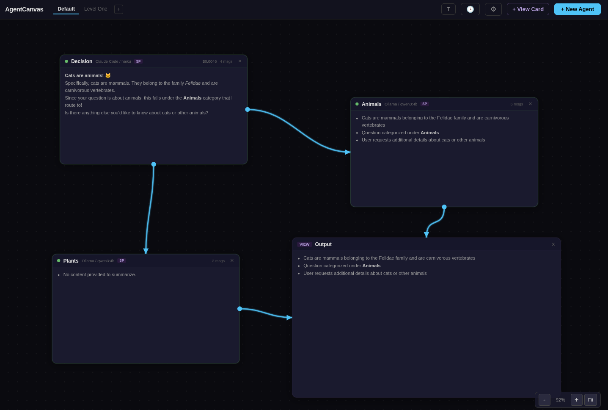

# AgentCanvas

A provider-agnostic AI agent orchestrator with a spatial canvas interface. Build multi-agent workflows by dragging cards onto an infinite canvas and connecting them with output routing.

Inspired by [OpenSwarm](https://github.com/openswarm-ai/openswarm), rebuilt from scratch around CLI-based agents (Claude Code) and API-based agents (Ollama) as first-class citizens.



## Highlights

- **Spatial canvas** — infinite zoomable workspace, multi-dashboard, BPMN-style collapsible cards, groups, marquee box-select
- **Multi-provider** — Claude Code (CLI subprocess) and Ollama (HTTP API), no API key needed for Claude Max
- **Workflow orchestration** — input cards, agent cards, view cards, **gate cards** (arbiter/synthesizer), **dialogue cards** (orchestrator-driven multi-turn councils), and connections with conditions, transforms, JSON schema validation, **circuit breakers**, and **workflow-level shared constraints**
- **Named routing** — `{{route:AgentName}}` tags for decision/router agents
- **MCP tool integration** — stdio and HTTP servers (full OAuth 2.1 + PKCE + dynamic client registration, per MCP spec 2025-03-26), per-tool permission policies, **per-card tool toggle** (disable tools for individual agents or dialogue participants), human-in-the-loop approval, built-in `invoke_agent` for sub-agent spawning
- **Configurable** — tabbed settings for API keys, Ollama base URL, canvas preferences (zoom sensitivity, grid size), and rebindable keyboard shortcuts
- **Session management** — real-time streaming, cost tracking, message branching, git worktree isolation, persistent across restarts, retry/edit any prompt

See the [full documentation](docs/index.md) for details.

## Getting Started

### Prerequisites
- Python 3.11+
- Node.js 20+
- (Optional) [Nix](https://nixos.org/) for a reproducible dev environment

### Quick Start

```bash
git clone https://github.com/barrulus/agentcanvas.git
cd agentcanvas

# With Nix
nix develop
./run.sh

# Without Nix — see docs/getting-started.md
```

Open http://localhost:5173 in your browser.

**Provider setup:**
- **Claude Code** — requires the `claude` CLI installed and authenticated. Works with Claude Max subscriptions.
- **Ollama** — requires [Ollama](https://ollama.com/) running locally. Pull a model with `ollama pull <model>`.

## Documentation

- [Getting Started](docs/getting-started.md) — installation, first agent, keyboard shortcuts
- [Workflow Orchestration](docs/workflows.md) — input/agent/view/gate cards, routing, constraints, circuit breakers
- [Architecture](docs/architecture.md) — system design, providers, storage
- [API Reference](docs/api-reference.md) — REST endpoints and WebSocket events
- [Data Models](docs/data-models.md) — Pydantic models and field reference

## License

[MIT](LICENSE)
