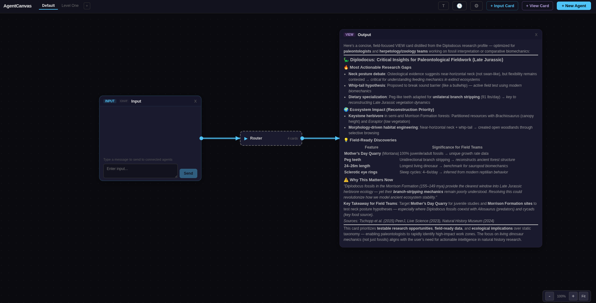
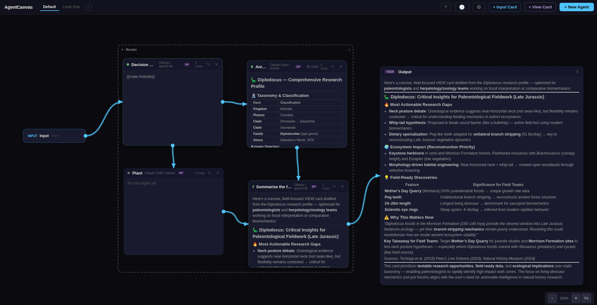

# Workflow Orchestration

AgentCanvas supports building multi-agent workflows where input flows through a chain of agents, each performing a specific task. This document covers how to build, configure, and run workflows.



## Concepts

### Input Cards

Input cards are workflow entry points. They don't have an LLM provider -- they're pure routing nodes that send content to downstream agents.

**Three source modes:**

| Mode | Description | Usage |
|------|-------------|-------|
| **Chat** | Manual text input box | Type a message, click Send. Content routes to all connected agents. |
| **Webhook** | HTTP POST endpoint | External systems POST JSON to `/api/input-cards/{id}/webhook`. The payload should include a `content`, `text`, or `data` field. |
| **File Watcher** | Polls a file/directory | Watches a path every 2 seconds. When the file changes, its content is sent downstream. For directories, the most recently modified file is used. |

**Creating an input card:** Click "+ Input Card" in the toolbar and select the source mode. For file watchers, you'll be prompted for the path.

### Agent Cards

Agent cards run LLM providers (Claude Code or Ollama). In workflows, agents are typically created without an initial message -- they wait for input from upstream connections.

**Creating a workflow agent:** Click "+ New Agent", configure provider/model/system prompt, and click "Create" (leave the initial message empty). The agent will sit in `idle` status until it receives routed input.

**Downstream locking:** When an agent has any incoming connection, its chat input is hidden and replaced with "Receives input from upstream connection". This prevents manual interference with the workflow.

### View Cards

View cards display output. Connect an agent to a view card to capture its final response. View cards render Markdown.

### Gate Cards

Gate cards (also called arbiter cards) collect outputs from **multiple upstream agents** and use an LLM to resolve them into a single result. Use them when several agents independently produce candidates for the same decision and you want to commit to one answer rather than averaging or concatenating.

A gate card waits until **every** upstream connection has delivered an output, then sends all of them to its configured LLM with a resolution prompt. Workflow [shared constraints](#workflow-level-shared-constraints) are automatically appended so the gate evaluates options against the same rules every other agent sees.

**Two modes:**

| Mode | Behavior |
|------|----------|
| **resolve** | Evaluate the candidates and **pick the best one** against the constraint set. Good for decision routing. |
| **synthesize** | **Merge** the candidates into a single coherent output, explicitly resolving contradictions. Good for consensus building. |

**Creating a gate card:** Click "+ Gate Card" in the toolbar, choose mode and provider/model, click Create. Connect two or more upstream agents to the gate. The gate auto-triggers when all upstream inputs arrive and routes its resolved output downstream like any other card.

**Reset:** Click "Reset" on the gate header to clear pending inputs and start over.

### Connections

Draw a connection by clicking a port (cyan dot) on one card and dragging to another card's port. Connections define the flow of data between cards.

**Connection properties** (right-click a connection to edit):

| Property | Description | Example |
|----------|-------------|---------|
| **Condition** | Filter: only route if output matches | `contains:error`, `regex:SUCCESS\|OK` |
| **Output Schema** | JSON Schema validation before routing | `{"type": "object", "required": ["summary"]}` |
| **Transform** | Reshape output before sending | `{{output.summary}}`, `Summarize: {{output}}` |
| **Gate Rule** | [Circuit breaker](#circuit-breakers): halts routing on failure | `require:approved`, `min_length:100` |

## Named Routing

For decision/router agents that need to direct output to a specific downstream agent, use **named routing tags**:

```
{{route:AgentName}}
```

### How it works

1. The router agent includes `{{route:Animals}}` in its output
2. The routing system extracts the tag and matches it (case-insensitive) against downstream agent names
3. Only the matching agent(s) receive the output
4. The route tag is stripped from the forwarded content
5. If the output is empty after stripping (i.e., only contained route tags), the original user input is forwarded instead

### Example: Decision Router

**Setup:**
```
[Input Card] --> [Decision Maker] --> [Animals Agent]
                                 --> [Plant Agent]
                                 --> [Summarizer] --> [View Card]
```

**Decision Maker system prompt:**
```
You are a classifier. Based on the input, determine if it's about animals or plants.
Respond ONLY with {{route:Animals}} or {{route:Plant}} -- nothing else.
```

**Result:** When "Tell me about dolphins" is entered, the Decision Maker outputs `{{route:Animals}}`, and only the Animals agent receives the query. The Plant agent stays idle.

### Multiple route tags

You can include multiple route tags to fan out to specific agents:
```
{{route:Animals}} {{route:Summarizer}}
```

## Workflow-level Shared Constraints

Multi-agent pipelines often degrade because each agent reasons about constraints independently. The result looks clean per-agent but doesn't align across the pipeline. Shared constraints fix this by giving every agent in the workflow the same rules to operate within.

**How it works:** Click the "Constraints" button in the toolbar and write the rules in the modal (free text — JSON, bullet list, plain prose, anything). When the workflow runs, the constraints text is automatically prepended to every message routed to an agent in this format:

```
[Workflow Constraints]
{your constraints}

[Task]
{the routed content}
```

Constraints are stored per-dashboard, so different workflows can have different rules.

**When to use them:**

| Use case | Example constraint |
|----------|-------------------|
| Output format | `All responses must be valid JSON with fields: decision, reasoning, confidence.` |
| Domain rules | `Never recommend deprecated APIs. Prefer open-source solutions.` |
| Budget/scope | `Total proposed budget must not exceed $10,000.` |
| Style | `Be concise. No marketing language. No hedging like "it depends".` |

Constraints are also injected into the resolution prompt of [gate cards](#gate-cards), so the arbiter evaluates candidates against the same rules.

## Circuit Breakers

Circuit breakers (gate rules) halt routing on a connection if the output fails a quality check. This prevents bad output from one agent corrupting downstream agents — the failure mode the multi-agent pattern is most vulnerable to.

Add a gate rule by right-clicking a connection and filling the **Gate rule** field in the editor.

**Supported rules:**

| Rule | Behavior |
|------|----------|
| `require:text` | Fails if `text` is **not** in the output |
| `reject:text` | Fails if `text` **is** in the output |
| `min_length:N` | Fails if output length is below `N` characters |
| `max_length:N` | Fails if output length exceeds `N` characters |

**Visual feedback:** When a gate rule blocks routing, the connection flashes red on the canvas with the failure reason for ~4 seconds. The downstream agent does **not** receive the message.

**Example:**
```
Connection: Reviewer -> Publisher
Gate rule:  require:APPROVED
```
The Publisher only receives output that contains the literal text `APPROVED` somewhere in the Reviewer's response. Anything else is blocked.

## Workflow Lifecycle

### Message clearing

When an input card sends new content, **all downstream agents are reset** before routing:
- Agent messages are cleared
- Status resets to `idle`
- Cost and token counts reset to zero
- View card content is emptied

This ensures each input starts with a clean slate.

### Stateless execution

Each agent invocation is independent -- there is no conversation history carried between messages. This is by design for workflow pipelines where each input should be processed fresh.

### Chaining

When an agent completes, its output is automatically routed to downstream connections. This creates chains:

```
Input --> Agent A --> Agent B --> View Card
```

Agent A completes, its output routes to Agent B. When Agent B completes, its output routes to the View Card. The routing system has a depth limit of 10 to prevent infinite loops.

## Card Collapse

Double-click any card's header to collapse it to a compact BPMN-style chip showing just the status dot, name, and model. Double-click again to expand.



Collapsed state persists in the layout. Connection lines automatically recompute their positions based on the collapsed dimensions.

## Groups

Select multiple cards with **Ctrl+click**, then click the "Group (N)" button in the toolbar.

Groups can be:
- **Collapsed** -- hides all member cards, shows a single compact box. Internal connections are hidden; external connections reroute to the group box.
- **Expanded** -- shows a dashed bounding box around members. Double-click the group header to rename.
- **Moved** -- drag the group header to move all members together.
- **Deleted** -- click the "x" on the group header (ungroups, doesn't delete cards).

## Webhook Integration

Webhook input cards expose an HTTP endpoint for external systems:

```bash
# Get the webhook URL (shown on the card)
POST http://localhost:8325/api/input-cards/{card_id}/webhook

# Send content
curl -X POST http://localhost:8325/api/input-cards/{card_id}/webhook \
  -H "Content-Type: application/json" \
  -d '{"content": "Tell me about elephants"}'
```

The payload should include one of: `content`, `text`, or `data`. Objects/arrays are JSON-serialized.

## File Watcher

File watcher input cards poll a file or directory every 2 seconds:

- **File:** Triggers when the file's modification time changes. The entire file content is sent downstream.
- **Directory:** Triggers when any file in the directory is modified. The most recently modified file's content is sent.

File watchers start automatically when the input card is created and survive server restarts.
